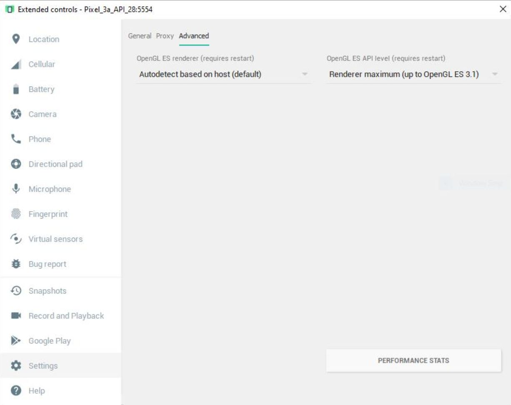

### Using the Android Emulator

- Install HAXM by again opening the SDK Manager, checking *Intel x86 Emulator Accelerator (HAXM installer)*, then clicking *Apply*. If the installer fails, see [HAXM Installation Troubleshooting](#HAXM-Installation-Troubleshooting).
- Create an Android Emulator through the AVD Manager (Android phone icon in the upper right). Pixel 2 with API 27 has been tested.
- In Android Studio, click the *Run->Run App* menu item and select your device if prompted.

### HAXM Installation Troubleshooting

The HAXM installer can fail for a number of reasons. Many solutions are discussed in [HAXM issue 105](https://github.com/intel/haxm/issues/105), including:

- Enabling Intel virtualization in the bios
- Disabling Hyper-V in Windows
- Disabling memory integrity in Windows
- Disabling virtualization security with the Device Guard and Credential Guard hardware readiness tool

### OpenGL ES 3 and AR settings

Open GL ES3 is required on Android Emulator. Otherwise one will run into the following errors when deploying it onto the Android Emulator:

`
D/: .../bgfx/src/renderer_gl.cpp (5638): BGFX CHECK glTexParameteri(targetMsaa, 0x813D, numMips-1); GL error 0x500: GL_INVALID_ENUM
A/libc: Fatal signal 5 (SIGTRAP), code 128 (SI_KERNEL), fault addr 0x0 in tid 1398 (mqt_js), pid 1349 (com.playground)
`

The GLES3 setting needs to be enabled from the Android Emulator settings:

*Before you can access this, you'll need to make sure that your Android emulator isn't in an integrated tool window in Android Studio.  If it is, you can pull it out into a separate window by closing the tab (if active), going to File -> Settings -> Tools -> Emulator, and uncheck Launch in a tool window.  Press OK once this is complete.*

First, open the Extended Controls window by pressing on the ellipses at the bottom of the controls bar:

From there, click on Settings, Advanced, and you should be able to see what GLES API Level you're using.

Ensure that the right Google Play Services for AR is installed on the Emulator per instructions [here](https://developers.google.com/ar/develop/java/emulator#update-arcore).