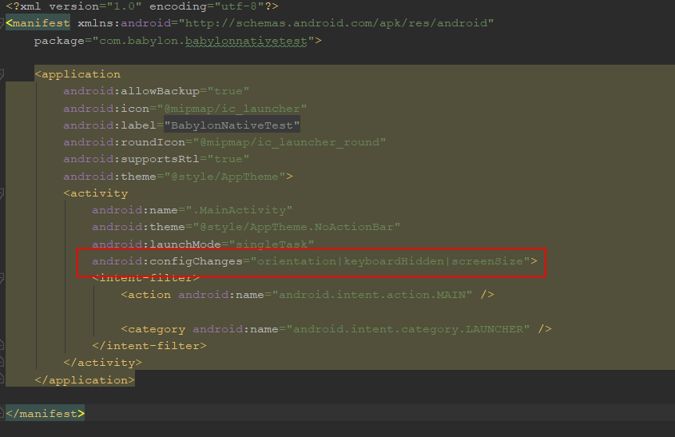

Please note this documentation is primarily and subject to change.
This documentation describes how to integrate BabylonNative in your Android project.
For more informations on the subject, check the following links:
https://www.babylonjs.com/
https://github.com/BabylonJS/BabylonNative

# Download NPM

NPM download is not automatic (for now). To download NPM, run this command in the destination folder :

```
npm install --prefix . babylonnativepackage
```

The package contains 4 .aar files. Debug and Release with and without V8.

# Project creation

Create a new Android Studio project with a Basic Activity


# Project Configuration

Configure the protject to use Java. BabylonNative requirement is Android 5.0+.


# BabylonNative Package

Import BabylonNative as a new AAR module. And Set the path to BabylonNative AAR


# Module dependency

Your app module must have BabylonNative set as a depency.


# Edit Activity

Start editing your JAVA activity and add the mandatory imports.

```
import BabylonNative.BabylonView;
```

Extend the MainActivity inherance so BabylonView can call methods from the activity

```
public class MainActivity extends AppCompatActivity implements BabylonView.ViewDelegate {
```

Add a BabylonView member

```
private BabylonView mView;
```

In the OnCreate method, replace the default view by a BabylonView

```
    @Override
    protected void onCreate(Bundle savedInstanceState) {
        super.onCreate(savedInstanceState);
        mView = new BabylonView(getApplication(), this);
        setContentView(mView);
        Toolbar toolbar = findViewById(R.id.toolbar);
        setSupportActionBar(toolbar);
    }
```

Add the obViewReady overriden method. This method is called by BabylonNative when the view is initialized and ready. "Scripts/experience.js" is a small default test script bundled in the package that displays a cube.

```
    @Override
    public void onViewReady() {
        mView.loadScript("Scripts/experience.js");
    }
```

At this point, your app is ready to be build and run. Once running, you should see a grey cube that you can rotate by touching your screen.
Now let's get a bit further and improve it a bit.
Open your app manifest and add the following line:



```
android:configChanges="orientation|keyboardHidden|screenSize">
```

This line tells Android to not reset the surface when the device orientation changes.

You can run script bundled in your app thanks to the loadScript method seen above. You can also run JavaScript string easily.
In the onViewReady method, add the line calling eval:

```
    @Override public void onViewReady()
    {
        mView.loadScript("Scripts/experience.js");
        mView.eval("setTimeout(function(){" +
                "var red = new BABYLON.StandardMaterial(\"red\", scene);" +
                "red.diffuseColor = new BABYLON.Color3 (128,0,0);" +
                "cube.material = red;" +
                "}, 2000);" , "testEval");
    }
```

This simple code will set a timer that will change the cube material to red after 2000ms.

# Known issues

BabylonNative uses V8 and bundles the .so for the various ABI (depending on the package .aar). There might be some conflicts if your app is also using V8.
