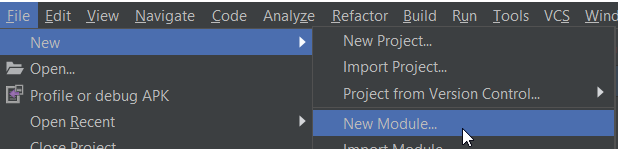

Please note this documentation is primarily and subject to change.
This documentation describes how to integrate BabylonNative in your Android project.
For more informations on the subject, check the following links:
https://www.babylonjs.com/
https://github.com/BabylonJS/BabylonNative

# Project creation

Create a new Android Studio project with a Basic Activity


# Project Configuration

Configure the protject to use Java. BabylonNative requirement is Android 5.0+.


# BabylonNative Package

Import BabylonNative as a new AAR module. And Set the path to BabylonNative AAR



# Module dependency

Your app module must have BabylonNative set as a depency.


# Edit Activity

Start editing your JAVA activity and add the mandatory imports.

```
import android.util.Log;
import android.view.MotionEvent;
import android.view.ScaleGestureDetector;
import android.view.SurfaceHolder;
import android.app.Activity;
import android.content.Context;
import android.content.Intent;
import android.net.Uri;
import android.os.Bundle;


import java.io.ByteArrayInputStream;
import java.io.ByteArrayOutputStream;
import java.io.File;
import java.io.FileNotFoundException;
import java.io.IOException;
import java.io.InputStream;
import java.nio.ByteBuffer;

import BabylonNative.*;
```

Now it's time to edit the activity. First, the activity inherance:

```
public class MainActivity extends Activity implements BabylonSurfaceView.Renderer {
```

BabylonSurfaceView handles threading updates and surface life for the activity. Check the class name corresponds to your Manifest.xml. By default it's MainActivity.
Then, copy and paste the methods used for your activity lifetime.

```
public class MainActivity extends Activity implements BabylonSurfaceView.Renderer {
    private static final String TAG = "AndroidViewAppActivity";
    BabylonSurfaceView mView;
    private ScaleGestureDetector mScaleDetector;
    private Uri mUri = Uri.EMPTY;
    public boolean mScaling = false;

    // Activity life
    @Override protected void onCreate(Bundle icicle)
    {
        Log.v(TAG, "onCreate");

        super.onCreate(icicle);
        mView = new BabylonSurfaceView(getApplication(), this);
        setContentView(mView);

        try {
            Wrapper.initEngine(getApplication().getResources().getAssets(), getDataDir(getApplicationContext()));
        } catch (Exception e) {
            e.printStackTrace();
        }
        class PinchListener extends ScaleGestureDetector.SimpleOnScaleGestureListener
        {

            @Override
            public boolean onScale(ScaleGestureDetector detector)
            {
                Log.v("TAG", "Pinch "+detector.getScaleFactor());
                Wrapper.setPinchInfo(detector.getScaleFactor());
                return true;
            }
            @Override
            public boolean onScaleBegin(ScaleGestureDetector detector)
            {
                mScaling = true;
                return true;
            }

            @Override
            public void onScaleEnd(ScaleGestureDetector detector)
            {
                mScaling = false;
            }
        }
        mScaleDetector = new ScaleGestureDetector(this, new PinchListener());

        handleIntent();
    }

    private void handleIntent()
    {
        Uri uri = getIntent().getData();
        if (uri == null) {
            Log.i(TAG, "Could not open document.");
            return;
        }

        mUri = uri;
    }

    private static String getDataDir(Context context) throws Exception {
        return context.getPackageManager()
                .getPackageInfo(context.getPackageName(), 0)
                .applicationInfo.dataDir;
    }

    private ByteBuffer readBytes(InputStream inputStream) throws IOException
    {
        int length = inputStream.available();
        ByteBuffer byteBuffer = ByteBuffer.allocateDirect(length);

        int bufferSize = 65536;
        byte[] buffer = new byte[bufferSize];

        int len = 0;
        while ((len = inputStream.read(buffer)) != -1) {
            byteBuffer.put(buffer, 0, len);
        }

        return byteBuffer;
    }

    @Override protected void onNewIntent (Intent intent)
    {
        Log.v(TAG, "onNewIntent");
        mUri = intent.getData();
    }

    @Override protected void onPause()
    {
        Log.v(TAG, "onPause");
        Wrapper.activityOnPause();
        mView.setVisibility(View.GONE);
        super.onPause();
        mView.onPause();
    }

    @Override protected void onResume()
    {
        Log.v(TAG, "onResume");
        Wrapper.activityOnResume();
        super.onResume();
        mView.onResume();
    }

    @Override protected void onDestroy()
    {
        Log.v(TAG, "onDestroy");
        Wrapper.finishEngine();
        super.onDestroy();
    }

    // Renderer override
    @Override public void onSurfaceCreated(SurfaceHolder surfaceHolder)
    {
        Log.v(TAG, "onSurfaceCreated");
        Wrapper.surfaceCreated(surfaceHolder.getSurface());
    }

    @Override public void onSurfaceChanged(int width, int height)
    {
        Log.v(TAG, "onSurfaceChanged");
        Wrapper.surfaceChanged(width, height, mView.getHolder().getSurface());
    }

    @Override public void onDrawFrame()
    {
        if (!Uri.EMPTY.equals(mUri) && mUri != null)
        {
            try {
                Log.i(TAG, "Handling intent to view URI : "+mUri.getPath());
                InputStream inputStream = getContentResolver().openInputStream(mUri);
                ByteBuffer byteBuffer = readBytes(inputStream);
                byteBuffer.position(0);
                Wrapper.openStream(byteBuffer);
            } catch (FileNotFoundException e) {
                e.printStackTrace();
            } catch (IOException e) {
                e.printStackTrace();
            }
            mUri = Uri.EMPTY;
        }
        Wrapper.step();
    }

    // Touch handling
    @Override public boolean onTouchEvent(MotionEvent event){
        mScaleDetector.onTouchEvent(event);

        if (!mScaling) {
            float mX = event.getX();
            float mY = event.getY();
            switch (event.getAction()) {
                case MotionEvent.ACTION_DOWN:
                    Wrapper.setTouchInfo(mX, mY, true);
                    break;
                case MotionEvent.ACTION_MOVE:
                    Wrapper.setTouchInfo(mX, mY, true);
                    break;
                case MotionEvent.ACTION_UP:
                    Wrapper.setTouchInfo(mX, mY, false);
                    break;
            }
        }
        return true;
    }

    @Override
    public void onWindowFocusChanged(boolean hasFocus)
    {
        super.onWindowFocusChanged(hasFocus);
        if (hasFocus && mView.getVisibility() == View.GONE)
        {
            mView.setVisibility(View.VISIBLE);
        }
    }
}

```