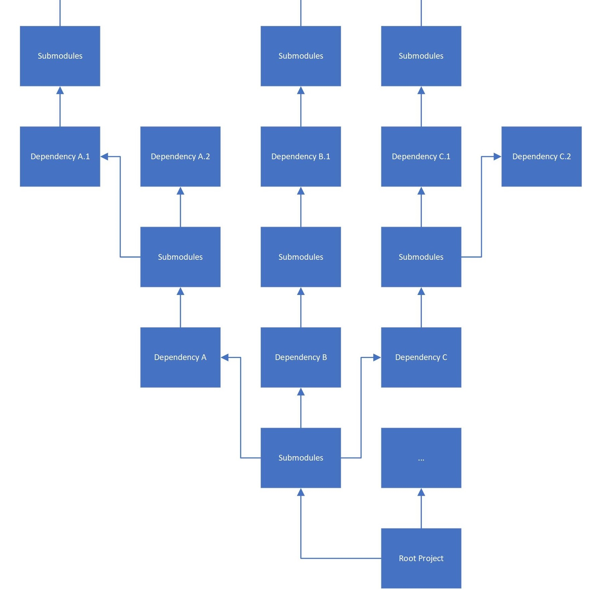
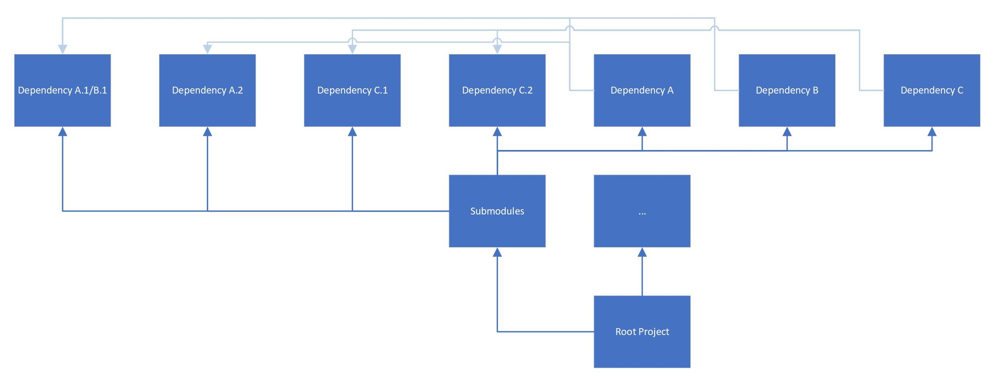

# The Babylon Native Build System

The Babylon Native build system is founded on a lateral dependency management strategy 
implemented using Git Submodules and CMake build targets. This system is designed to be
as extensible and flexible as possible: it should be easy to add new features/extensions,
and it should be easy to incorporate Babylon Native into other existing projects. This 
document provides an overview of the concepts underpinning the Babylon Native build system
and outlines some of the reasoning and intent behind them.

## Lateral Dependency Management

Scalable dependency management can be a challenge when making heavy use of Git Submodules.
The Babylon Native build system addresses this challenge using a strategy we've informally
described as *lateral dependency management*. To explain what this is and the motivation
behind it, we'll begin by exploring some of the problems this strategy attempts to solve.

One of the biggest challenges of dependency management with Git Submodules is that, when 
creating submodules in isolation, efforts to make each repository self-contained often 
lead to submodules bringing along their own dependencies, often as other submodules, 
resulting in a submodule "tree" that can rapidly become unwieldy. For the purposes of 
this discussion, we'll call this approach *vertical dependency management*.

As illustrated in the diagram above, vertical dependency management can result in rather
clunky and confusing repository structures that do not very well as the number of 
dependencies rises. More problematic, however, is the difficulty that arises if two or more
"first tier" dependencies actually share a dependency of their own, or if they depend on 
each other. For example, consider what would happen if `Dependency A.1` and `Dependency B.1`
were actually the same library. Because `Dependency A` and `Dependency B` were developed
as independent standalone repositories, they each "bring along" their own copy of the 
shared dependency (and they even bring along different versions), causing that dependency 
to essentially be incorporated twice into `Root Project`, which will cause problems.

The Babylon Native build system's strategy of *lateral dependency management* was 
principally created to avoid this "shared dependency" problem. Instead of a nested, vertical
approach where every submodule is a standalone repository that "brings along" everything it
needs, submodules are instead intended to *not* bring their own dependencies with them. 
Instead, all submodules are added to the `Root Project` directly, making it the top-level 
repository's responsibility to ensure that all dependencies (and their dependencies, and so
on) are provided for.

The "greyed out" dependency arrows in the above diagram allude to the indirect manner by
which submodules depend upon each other: dependency relationships are controlled by CMake
target name, not by repository location. For example, `Dependency A.2` might expose a 
CMake library target called `dependency-a-2`, which the `Dependency A` submodule would
then attempt to link to by name. A more detailed description of this is provided in a 
[later section](#connecting-it-all-with-cmake).

This approach has several advantages when contrasted with vertical dependency management.

- The structure of the project is substantially simplified.
- It is now possible for multiple submodules to share a dependency without including 
redundant copies of the dependency.
- The root-level repository now has substantially more control. Because the `Root Project`
is now responsible for satisfying *all* dependencies, including dependencies of 
dependencies, it is now in a position to make arbitration decisions about what gets included
and at what version. For example, in the diagram above, both `Dependency A` and 
`Dependency B` depend on `Dependency A.1/B.1`; but because they now only attempt to link to 
their dependencies by name (in this case, perhaps `Dependency A.1/B.1` exposes a target 
called `dependency-x-1`), the submodules are no longer tightly coupled to a particular 
version of their dependency. `Dependency A` and `Dependency B` might have been developed 
against slightly different but API-compatible versions of `Dependency A.1/B.1`. While this 
would have been a problem with vertical dependency management, lateral dependency 
management allows the `Root Project` to arbitrarily decide that the more recent of these 
versions (or even a different API-compatible version) is the right one for `Root Project`'s 
use case; and because the provided version still exposes the `dependency-x-1` target, both 
`Dependency A` and `Dependency B` will automatically link to it by name without requiring 
any modification to the submodules themselves. `Root Project` could even choose to 
"polyfill" the depency with an entirely different API-compatible implementation, and as 
long as that implementation was exposed under the expected target name, `Dependency A` and 
`Dependency B` would correctly link to it and the build would "just work."

These advantages come at the cost of a small number of corresponding disadvantages and 
"quirks."

- Because they no longer "bring along" everything they need, submodules designed to be used 
in a lateral dependency management scenario cannot be thought of as stand-alone libraries. 
This problem can be mitigated by pairing each repository of this kind with a default 
"harness" repository which consumes it as a submodule, laterally supplies its dependencies, 
and allows the building of a stand-alone library.
- Many existing repositories follow patterns more reminiscent of vertical dependency 
management and so do not fit perfectly into a lateral dependency management strategy. This
is usually not a problem; the vertically-dependent submodule can simply be treated as a 
"leaf" dependency with no dependencies of its own, thus allowing the submodule's internal
vertical dependency management to exist "inside" the encompassing lateral dependency 
management mechanism. Note that this will not work if more than one submodule employs this
stragety to import the same shared dependency, as described above. However, if this 
happens, then the two or more dependencies in question are fundamentally incompatible as 
submodules; the problem cannot be solved by either lateral or vertical dependency 
management, and it is likely that another approach, such as the modification of one or more
of the repositories, will be necessary in order to allow these submodules to work together.
- Assigning the responsibility for supplying *all* dependencies to the `Root Project` 
makes each dependency submodule less of a "black box" because the `Root Project` must now
know about the submodule's dependencies so that it can supply them. In practice, this tends 
to be a small cost, as adding additional submodules is not difficult and makes the 
repository no more heavyweight than it would be otherwise. Still, with regards to the 
encapsulation of information and the hiding of implementation details, it is a disadvantage
or "quirk" worth noting.

In summary, lateral dependency management allows the dependency structure of a repository
to scale *out* instead of *up*. It does this by treating submodule dependencies not as 
independent, self-contained libraries, but as modular components intended to function as 
part of an assemblage, the implementation of which is the responsibility of the root-level
repository. The following sections describe how this idea is implemented within the Babylon
Native build system.

## Components as Submodules

## Connecting It All With CMake
