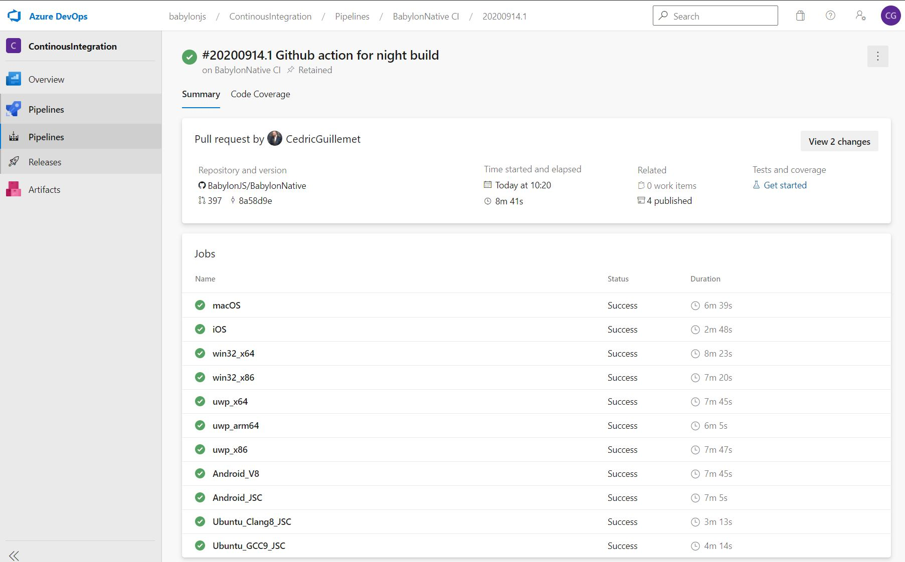
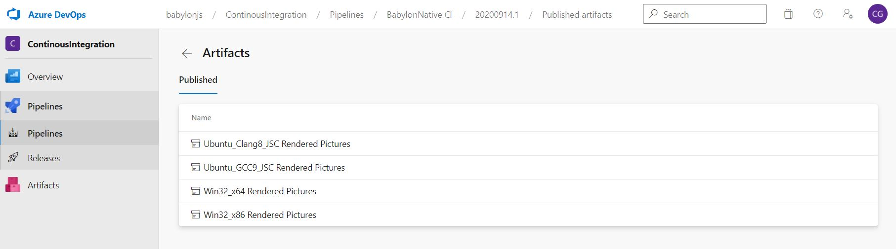
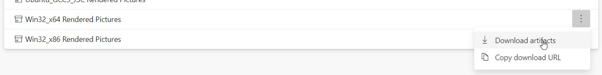
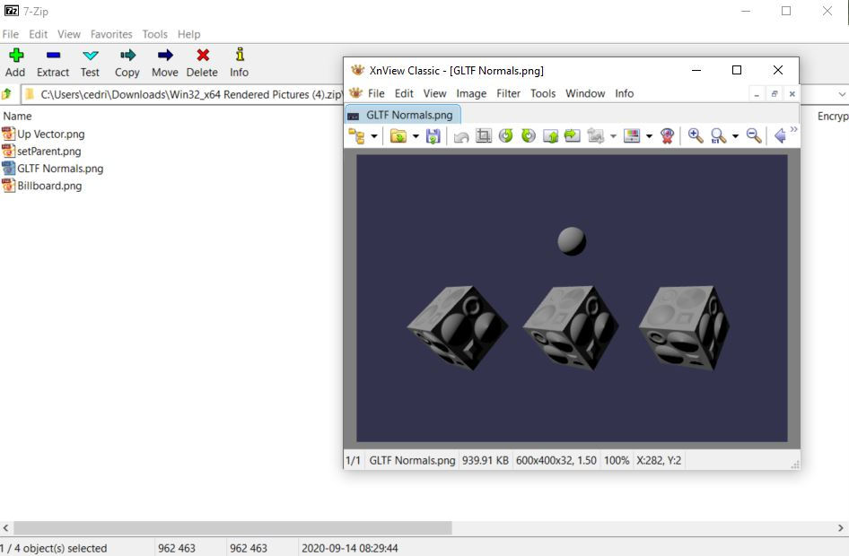

This page describes the Continuous Integration (CI) used for BabylonNative.
The CI helps improve the quality of code for all platforms and avoid regression by testing the engine against various test scenes. Idealy, there is one test scene for every single feature of babylonjs.
Validation works by running the engine with a JS script that creates a scene. The rendering is captured and compared with a reference image.
If the rendered and reference images are too different, the test fails, an error will raise in the CI (failed build) and rendered/error images are stored as an download artefact than can help debug.
This is done for various platforms when a PR is opened, for nightly build and when a PR is merged in master branch.
CI will also take care of code quality: Warnings are treated as error and will break the build. A PR can't be merged if the build fails.

CI validation is composed of 3 main parts:
- The test datas
- The ValidationTests app
- The platform integration

# Test datas
They are shared with babylonjs for the most part.
Validation test scenes are listed in ```Apps\ValidationTests\Scripts\config.json```. It lists playground identifier that will be opened sequentialy. Per PG is may have additional parameters for validation pixels difference threshold.
This json is a subset of babylonjs' one. The goal is to use the exact same file once the engine is in a sufficiently stable state.

```
{
    "root": "https://cdn.babylonjs.com",
    "tests": [
        {
            "title": "setParent",
            "playgroundId": "#JD49CT#2",
            "referenceImage": "setParent.png"
        },
        ...
}
```

Once the PG is loaded and a screenshot is saved on disk, it's compared to a reference image.
Those images are accessible here : https://github.com/BabylonJS/Babylon.js/tree/master/tests/validation/ReferenceImages

If a new scene to test is added in the json file, a new reference must be added to babylonjs repo.
If a new feature or a bug fix makes the reference image different, it must also be updated.

# ValidationTests app

To make it simple, the validationTests app initialize the engine and runs ```Apps\ValidationTests\Scripts\validation_native.js```.
That js script is responsible for loading the json, running each test PG, make the screen capture and compare images.
When completed, the executable returns a value (0 for success, any other value for failure) that is used by the pipeline to determine the build success.

## The app executable

It's very similar to the playground app: 
- creates a window
- initialize engine and JS standard components
- initialize validation JS components
- loads and ```validation_native.js```
- returns a value depending on success

The validation JS components are function needed for the execution of the validation script.
It adds features like loading and saving .png from a byte array, asks the renderer to do a screen shot, get working directories and exiting the app.
These features are multiplatform and the code can be found here : ```Apps\ValidationTests\Shared\TestUtils.h```

## The test script

It loads the json using XMLHttpRequest, then for each entry in the json, loads the Playground, runs it, make a capture.
The most important part is the image comparison. It works the same way as babylonjs validation test.
The function ```compare``` is responsible for comparing each pixel. Every pixel for a same coordinate that is too much different between reference and rendering are counted.
If the number of different pixels are over a threshold, the test fails.
The difference threshold for a pixel is parametrized by the variable ```threshold```. The range is [0..255]
The number of different pixels is parametrized by the variable ```errorRatio```. The range of this value is (0 : no different pixel allowed, 100: every pixel can be different)

# The platform integration

Before being able to run the validationtests App, the build must succeed at building the platform. Any syntax error, warning, linking issue,... will result in a failure.
To be successful, the build must be able to generate all executable for all platforms and run the validationTest for supported ones.
Integration for the various platform can be tricky and is very specific to the platform. 
It's possible to open a window and have an openGL or Direct3D with a headless server.
For Apple platforms and Metal, it's was not possible to do the same.

The CI commands to run the validation is almost the same between PR build and nightly.
The tests are performed in ```azure-pipelines.yml``` after the build commands.

## Win32

By far the simplest CI tests. Runs the feshly built executable in the working directory.
```
    cd buildWin32_x64\Apps\ValidationTests
    mkdir Results
    mkdir Errors
    cd Release
    ValidationTests
```
Results and Errors directory are used for the Artifacts (see below).

## Linux

Almost the same as win32 but the headles  display has to be configured:
```
    export DISPLAY=:99
    Xvfb :99 -screen 0 1600x900x24 &
    sleep 3
    cd build/Apps/ValidationTests
    mkdir Errors
    mkdir Results
    ./ValidationTests
```
The ```sleep 3``` command lets Xvfb finish initializing before running the command. 3 seconds is an arbitraty value.

## Android (WIP)

The tests are performed in a virtual machine aka Android Emulator. First thing to do is to create and start it:
```
    echo "no" | $ANDROID_HOME/tools/bin/avdmanager create avd -n test_android_emulator -k 'system-images;android-27;google_apis;x86' --force
    nohup $ANDROID_HOME/emulator/emulator -avd test_android_emulator -no-snapshot -skin 600x400 > /dev/null 2>&1 & $ANDROID_HOME/platform-tools/adb wait-for-device shell 'while [[ -z $(getprop sys.boot_completed | tr -d '\r') ]]; do sleep 1; done; input keyevent 82'
```

Then, we can install the validationTests .apk and launch the activity:
```
    adb install -t -g Apps/ValidationTests/Android/app/build/outputs/apk/debug/app-debug.apk
    adb shell am start -n com.android.babylonnative.validationtests/com.android.babylonnative.validationtests.ValidationTestsActivity
```

As the Emulator runs as a separate process, it's important to wait for the activity to stop:
```
    while [[ $(adb shell pidof com.android.babylonnative.validationtests) -ge 1 ]]; do sleep 1; done;
```

As the validation images are stored in the Emulator, it's mandatory to pull back the resulting datas so we can build the artifact.

```
    adb exec-out run-as com.android.babylonnative.validationtests tar c cache/ > Captures/cache.tar
```

## Artifacts

Artifact is a zip file, accessible thru the Azure build page. That zip file contains the rendered images and error screen that can be used for debugging. On Android, it also contains the logcat.
To see the artifact, go the the build page:



Click on the published artifact item to see all the published artifact for that particular build:



Then, for the intended plaform, download the .zip:



Finaly, open the zip file. It will contain all rendered images for the build. If the build fails at build time, no artifact will be produced. If the image comparison fails, an artifact containing the image difference will be published.



