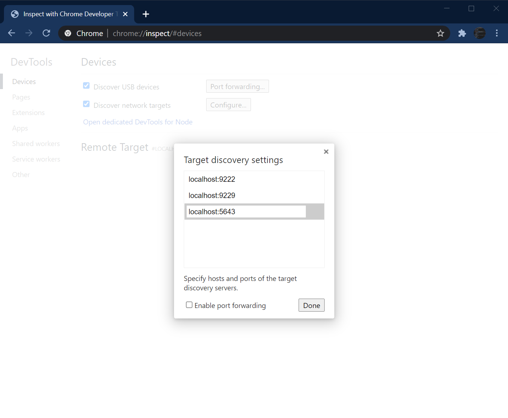
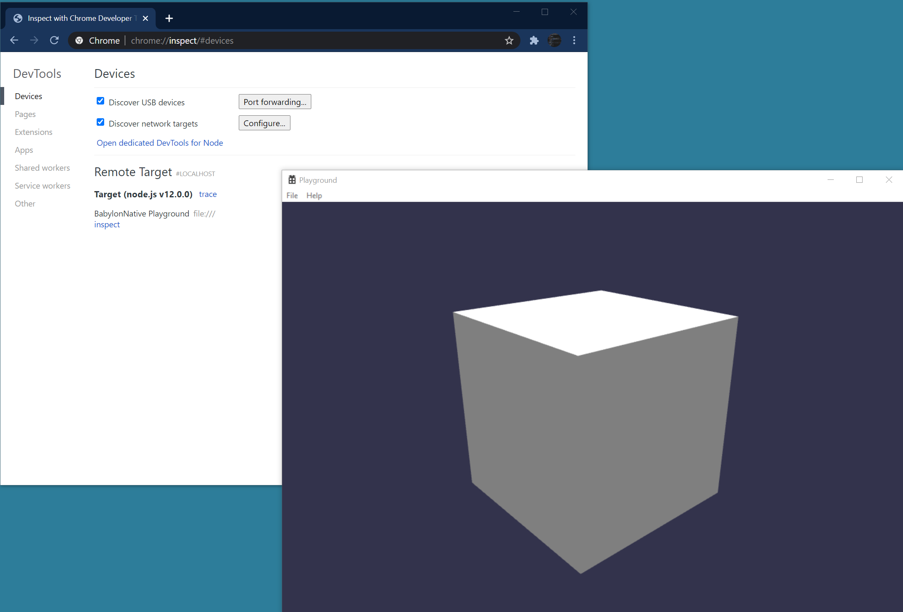
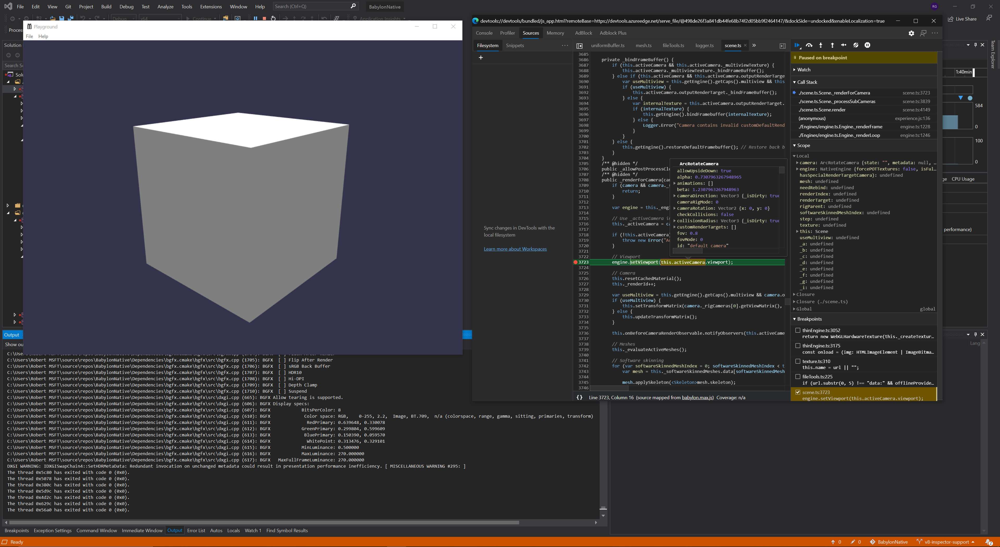

# BabylonNative Script Debugging on Win32 and Android
You can use Chromium DevTools to debug your JavaScript while running a Win32 BabylonNative application (x86/x64) or Android with the V8 JavaScript engine.

## Set up BabylonNative to Use V8
When running CMake, be sure to specify the following flag in order to use V8 as the underlying JavaScript engine (overriding default behavior, which on Windows is to use the Chakra engine):
`-D NAPI_JAVASCRIPT_ENGINE=V8`

For example:
```powershell
mkdir Build
cd Build
cmake -A Win32 -D NAPI_JAVASCRIPT_ENGINE=V8 ..
```

for Android, simply open the Playground project with AndroidStudio. V8 is the default JS engine for this platform.

## Add the Remote Target URL
Depending on which Chromium-based browser you're using (Edge or Chrome), navigate to `edge://inspect` or `chrome://inspect`.
Click `Configure...` and in the target discovery settings add an entry `localhost:{port}`, where `{port}` is consistent with the one supplied to the call to [`StartInspector`](https://github.com/BabylonJS/BabylonNative/blob/2db465f5569d8eb833245a41030c5219cfa3fe59/Apps/Playground/Win32/App.cpp#L141-L144) in App.cpp. This function call spins up the server responsible for communicating with the DevTools inspector client on the specified port, identifying itself with the specified title.
If you don't modify the code in the Playground Application, then the port will be 5643 and the app title shown on the DevTools page will be "BabylonNative Playground".



## Click Inspect
Run the Playground application and wait for the DevTools page to recognize the inspector server spun up by the app. Once you see the app pop up in the list of Remote Targets, you may click inspect to open up a DevTools window.



## View Logs, Set Breakpoints, Profile, and More
Once you have the DevTools window open, you can use it in the same way as if you were inspecting a web page.
For more information, see this documentation from Google on [how to debug JavaScript using Chrome DevTools](https://developer.chrome.com/docs/devtools/javascript/).


