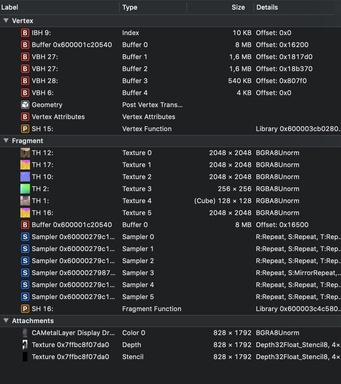

Xcode provides an excellent toolchain to capture and debug Metal rendered frames for iOS and MacOS.
This quick tutorial was captured on iOS simulator. It works exactly the same for BabylonNative MacOS.


Once BabylonNative is running on the simulator, get back to Xcode and capture the frame using this menu option


After a couple seconds, you will have a view that looks like this:


On the left: draw calls and resources binding (vertex buffers, textures, render pipelines,...)
Top middle: vertex and fragment pipelines view for the draw call
Bottom middle: list of resources for the draw call
Top right: result of the draw call for all the bound render targets
Bottom right: debug output

As with RenderDoc, you can debug by inspecting draw calls; where resources are commited to rasterize triangles.
Inputs streams (positions, UV, normals) are transformed by the vertex shader to produce (usualy) screen space streams.
Those streams are used to render triangles where each pixel passes trough a fragment shader that returns a color.
Vertex and fragment shaders processing are parametrized by uniforms (matrices that convert from world space to screen space, light position and orientation, ...)



When a rendering goes wrong, one or multiple parts of that pipeline are also wrong.
If nothing is displayed, check you have all the resources (shaders, vertex buffer, textures,...) bound.
If something is missing, a call to the rendering engine is missing.
If every thing is bound, then it's time to take a closer look.
First thing to check is the geometry. It's common to expect a mesh to be rendered but you render something else because of previous stream is not replaced for example.
If you double click the geometry in the vertex view, you'll see the mesh after transformation by the vertex shader that is used for the draw call:


The white rectangle corresponds to the display view.
See the vertex stream dumped in the bottom right list.
If your geometry is completely off screen you should see it here.

You can modify the virtual debug camera and select a particular triangle to see the stream vertices that is producing it.


Also, note the white truncated pyramid that corresponds to the perspective and view matrix.

To check the uniforms, double click on the Buffer 0 both for vertex and fragment shaders.
The data in that buffer then looks like this:


The order of bound values can be checked by double clicking on the Vertex Function. The shader source uses a struct ```Frame``` that corresponds to the bound uniform buffer.


And it works the same for fragment shader:


The corresponding shader:


Last but not least, in the fragment, check the bound textures and samplers.
Basically, a sampler is a GPU object and its properties that specifies how a texture is sampled.


The texture is also visible in the debugger.


Once you are done debugging a frame, you can stop the application or continue execution and capture another frame.
To do so, release the capture:

