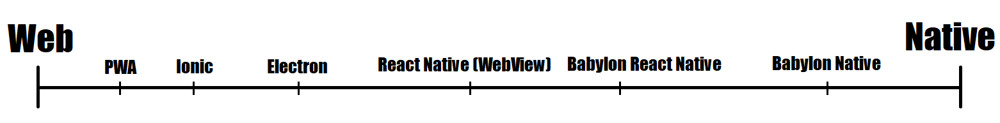

# When to Use Babylon Native

## Questionnaire

For each of the following questions, click on the link you feel best 
represents your answer. The link will take you to another view of this
same page with the next question for you at the top of your view. 
Eventually, a link will take you to a lower section discussing whether
or not we believe a Babylon Native technology might be right for your
scenario and why.

***

#### Does your project need rendering code to be shared between Web and native deployments?
-   [Yes, I need Web and native deployments to share rendering code.](#are-you-picking-a-platform-for-a-new-app-or-is-your-apps-platform-already-decided)
-   [No, having multiple deployments share rendering code isn't a priority for me.](#are-you-picking-a-platform-for-a-new-app-or-is-your-apps-platform-already-decided)

#### Are you picking a platform for a new app, or is your app's platform already decided?
-   [I'm picking a platform for my new app.](#do-you-prefer-more-native-like-technologies-or-more-web-like-technologies)
-   [I'm adding rendering to an app that's already committed to a platform.](#is-your-app-built-on-react-native-another-javascript-using-platform-including-web-or-hybrid-app-platforms-or-non-javascript-technologies)

#### Do you prefer more native-like technologies or more Web-like technologies?
-   [I prefer more native-like technologies.](#do-you-have-exceptional-rendering-requirements-such-as-aaa-quality-graphics-or-extreme-performance-needs)
-   [I prefer more Web-like technologies.](#do-you-already-have-existing-expertise-andor-preferences-for-react-native-or-do-you-need-native-capabilities-that-arent-provided-by-normal-web-apis-such-as-ar-on-ios)

#### Do you have exceptional rendering requirements such as AAA-quality graphics or extreme performance needs?
-   [I want things to look good, but I don't need extreme graphics or performance.](#babylon-native-is-probably-a-good-choice-for-your-project)
-   [I need AAA-quality graphics and/or exceptional performance.](#there-may-be-other-choices-better-suited-to-your-project-than-babylon-native-technologies)

#### Do you already have existing expertise and/or preferences for React Native, or do you need native capabilities that aren't provided by normal Web APIs (such as AR on iOS)?
-   [Yes.](#babylon-react-native-is-probably-a-good-choice-for-your-project)
-   [No.](#there-may-be-other-choices-better-suited-to-your-project-than-babylon-native-technologies)

#### Is your app built on React Native, another JavaScript-using platform (including Web or hybrid app platforms), or non-JavaScript technologies?
-   [My app is a React Native app.](#babylon-react-native-is-probably-a-good-choice-for-your-project)
-   [My app's platform uses JavaScript, but it isn't made with React Native.](#there-may-be-other-choices-better-suited-to-your-project-than-babylon-native-technologies)
-   [My app's platform doesn't inherently use JavaScript.](#do-you-have-exceptional-rendering-requirements-such-as-aaa-quality-graphics-or-extreme-performance-needs)

***

## Babylon Native is probably a good choice for your project!

Congratulations! If you ended up here, then we think Babylon Native may
be a suitable choice for adding Babylon.js to your project. Typically, 
applications for which Babylon Native is well-suited tend to be developed
as true native apps (C++, C#, etc.) which require rendering as a 
feature, though not necessarily the focus. Examples might include the
following:

-   A presentation app written in C# that needs to be able to render 3D 
    as well as 2D content.
-   A scientific simulation utility written in Java that wants to be able 
    to render data.
-   A 3D content generation tool written in C++ that wants to be able to 
    preview its output.

The main reason Babylon Native is well-suited for these scenarios is 
because Babylon Native makes it possible to bring Babylon's 
rendering capabilities into native applications with *extremely* minimal
requirements regarding app and development infrastructure. In other words,
Babylon Native is perhaps the simplest way to add Web-style rendering
to a native application without having to pivot that application to 
*become* a Web app.

***

## Babylon React Native is probably a good choice for your project!

Congratulations! If you ended up here, then we think Babylon React Native
may be a suitable choice for adding Babylon.js to your project. There are 
two main situations when Babylon React Native is a particularly good choice 
for a project:

-   When the project is already being built with React Native and wants to
    add GPU-accelerated rendering as simply as possible.
-   When the project requires capabilities that aren't typically exposed
    to Web-like platforms.

In the former case, if your app is already committed to React Native as a 
platform, Babylon React Native is one of two options to add rendering to
your project using Babylon.js. The second of these options is to simply
use Babylon.js in a WebView, and there are some advantages to this 
approach: it can sometimes yield better JavaScript performance (on iOS,
WebViews are allowed to run JavaScript with JIT enabled while React 
Native, and consequently Babylon React Native, are not) and it will 
provide access to the very latest Babylon.js features, which may not 
always be available in Babylon React Native. However, there are 
disadvantages as well: a WebView will create a second JavaScript context
distinct from React Native's main JavaScript context and you will have to
manage communication between the contexts manually, which can be complex
and/or slow and may negatively impact memory footprint as you pay the 
memory cost for two JavaScript contexts instead of one. Furthermore, 
running inside a WebView will restrict you to only the features that the 
platform's WebView allows, whereas with Babylon React Native you can 
extend your JavaScript-exposed capabilities by reaching through the 
platform into the native layer itself.

This segues directly into the second situation when Babylon React Native
is a particularly good choice: when you need capabilities that aren't 
typically exposed to Web-like platforms. The most blatant example of a
case like this is AR on iOS. Apple does not expose ARKit to JavaScript, 
which means that JavaScript-based logic (such as Babylon.js) cannot power
XR experiences on Apple platforms. Babylon React Native, however, 
overcomes this limitation by augmenting its JavaScript capabilities to 
allow AR apps using the same code on both Android and iOS. Thus, for any
developer seeking to use Web-like technologies to develop AR-capable apps
that run on iOS (or use any other platform feature not exposed to 
JavaScript), Babylon React Native may be the best -- and perhaps even the
only -- viable choice.

***

## There may be other choices better suited to your project than Babylon Native technologies.

If you've ended up here, then Babylon Native technologies may not be the
best options for your particular scenario. There are a number of reasons
this might be the case, but the most common boil down to, "You don't need
Babylon Native's or Babylon React Native's special capabilities, so there
are simpler alternatives that may suit your needs better."

Babylon Native and Babylon React Native both belong on the spectrum of
*hybrid app platforms* -- platforms which combine features of Web and
native environments -- and both lie more toward the native side of the
spectrum than toward the Web side.

Generally speaking, developers will approach hybrid apps from a basis of
familiarity with one or the other end of the spectrum (dedicated React 
Native developers are an exception), and the further one goes on the
spectrum from one's prior familiarity, the more complex a platform will
be to use. Babylon Native and Babylon React Native, while still hybrid
app technologies, are both significantly dissimiliar from a "true" Web
platform, and a Web developer has many other hybrid platform options that
are significantly more similar to the Web and are thus likely to be simpler
for that developer to use. Likewise from the opposite perspective, a 
developer more familiar with native platforms may find Babylon Native and
Babylon React Native more complex to use than a pure native solution such
as a Unity or Unreal. (Again, dedicated React Native developers are a bit
of an exception as their baseline familiarity lies with neither native
nor Web; however, they are also much less likely to be reading this 
section as it's very likely that Babylon React Native will be a suitable
choice for their preferred platform.) Thus, the most common reason why
a Babylon Native technology may not be the most suitable platform for a 
given usage is simply, "There's a simpler alternative that will suffice in 
your scenario."

Less commonly, Babylon Native technologies may not be suitable for a 
particular app because the app requires something Babylon Native does not
provide well. For example, a usage that depends on AAA-quality graphics,
leveraging the latest features in specialized rendering pipelines, may 
not find its needs met by Babylon Native technologies because Web 
rendering technologies in general typically lag behind native rendering
capabilities by several years. Similarly, apps with significant 
performance constraints may not be well-served by Babylon Native
technologies because Babylon.js scene logic runs in JavaScript, which 
incurs inherent performance cost. This can even manifest between seemingly
comparable alternatives, such as comparing Babylon React Native to 
Babylon.js in a WebView on iOS; in this scenario, depending on what 
exactly is being rendered and how, the specialized optimizations Babylon
React Native can do thanks to its "native" nature may or may not fully
offset the performance penalty of running JavaScript without JIT (which
Apple permits for WebViews but prevents for Babylon React Native). In 
nuanced scenarios such as this, the only way to know for sure which
approach might perform better for the particular rendering in question
would be to try both and measure, but both will run less speedily than
a pure-native (not Web-like) rendering solution like Unity or Unreal.

### So If I Shouldn't Use Babylon Native, What Should I Use?

The answer to this question depends on *why* Babylon Native technologies 
weren't ideally suited for your scenario.

-   Did you simply not need Babylon Native's specialized capabilities
    such that a simpler alternative would suffice? If so, other options
    such as 
    [Progressive Web Apps](https://en.wikipedia.org/wiki/Progressive_web_application), 
    [Ionic](https://ionicframework.com/),
    or 
    [Electron](https://www.electronjs.org/)
    may be worth looking into. (Comparing these alternatives is beyond the
    scope of this document.)
-   Did your particular scenario run poorly in Babylon React Native on iOS
    due to the unavailability of JIT? If so, you might try rendering the 
    same thing using Babylon.js in a WebView.
-   Do you need rendering speed or fidelity that seems to be beyond what
    Web-like rendering can provide? If so, pure native rendering solutions
    like 
    [Unity](https://unity.com/)
    or
    [Unreal](https://www.unrealengine.com/)
    may provide what you're looking for.
-   Do you need additional help thinking about what platform might be best
    for you? If so, please don't hesitate to ping us on the 
    [the Babylon.js forum](https://forum.babylon.js.com/c/questions/)
    and we'll be happy to help you weigh the options.

Thanks for considering Babylon Native and Babylon React Native!
