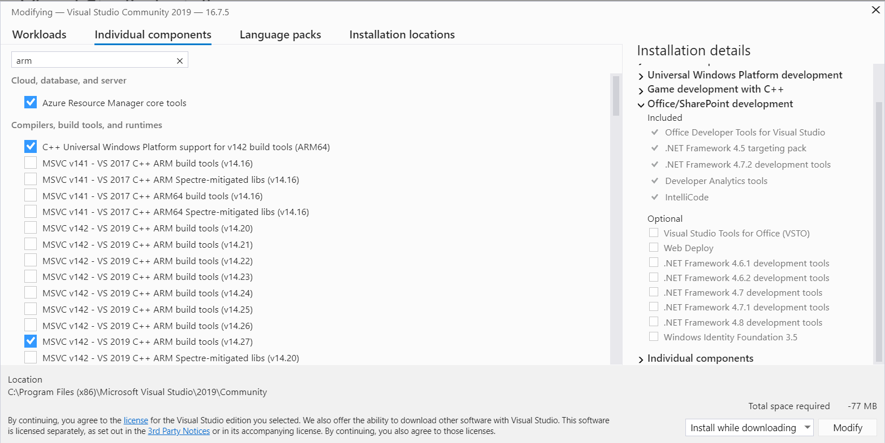

# Frequently asked questions

## Could you explain BabylonNative

[Here is an article that describes the motivation behind Babylon Native.](https://babylonjs.medium.com/babylon-native-821f1694fffc)

## Unable to build for arm64 on Windows

cmake displays such error:
```
C:>cmake -D CMAKE_SYSTEM_NAME=WindowsStore -D CMAKE_SYSTEM_VERSION=10.0 -A arm64 ..
-- Selecting Windows SDK version 10.0.18362.0 to target Windows 10.0.
CMake Error at CMakeLists.txt:5 (project):
  Failed to run MSBuild command:

    C:/Program Files (x86)/Microsoft Visual Studio/2019/Community/MSBuild/Current/Bin/MSBuild.exe
```

Check you have installed MSVC for arm64. 
In VisualStudio, go to menu `Tools` -> `Get Tools and Features`. Then check for arm64



## Unable to run BabylonNative on Android Simulator

[A detailed page is avaible here.](AndroidSimulator.md)

## Does Babylon Native support WASM?

The JavaScript virtual machines (JavaScriptCore, V8, Chakra, ...) that we have so far all support WebAssembly automatically.
